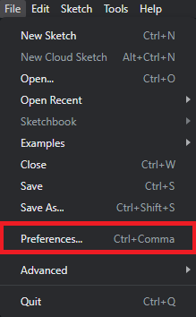

<h1 align="center"> OpenSpritzer v2 - Installation Manual</h1>

  

<h2 align="left">
Overview
</h2>

 

This document contains detailed assembly instructions, a software guideline and includes a parts list.

The Arduino code and 3D casing files (SCAD) for either 3D printing or laser cutting (STL and DXF) can be downloaded <a href="https://github.com/OpenSourceNeuro/OpenSpritzer-V2/tree/main/Casing"><strong>here</strong></a>, and further modified to fit customise purposes. The device is designed to regulate the pressure and duration of a single or repeated puff(s) of compressed air. Typically, the output air port is connected to a glass puffer pipette which has been drawn into a sharp point with a narrow (2-3μm) diameter pore.

The device itself consists of a printed circuit board, a microcontroller, a solenoid valve, a pressure regulator with a manometer and various interface, off-the-shelf, components.

The device is here shown without its covering lid.
The pressure regulator is mounted on the right and attached to the front panel via a retaining threaded ring that comes with the regulator.
M3 threaded spacers are mounted onto the PCB and are meant to be screwed to the top and bottom part of the box.
The solenoid is screwed directly onto the PCB.
The manometer is locked onto the front panel with a 3D printed part and two M3 bolts.

  

## Driver Installation

 

OpenSpritzer firmware runs on an Espressif ESP32 board and requires the USB to UART bridge <a href="https://www.silabs.com/developers/usb-to-uart-bridge-vcp-drivers"> CP210x driver</a>,  which can be downloaded<a href="https://www.silabs.com/developers/usb-to-uart-bridge-vcp-drivers?tab=downloads"> <strong>here</strong></a>.

Once the driver has been installed, users can upload and modify the <a href="https://github.com/OpenSourceNeuro/OpenSpritzer-V2/tree/main/Arduino/OpenSpritzer_V2">microcontroller code</a> through the <a href="https://www.arduino.cc/en/software">Arduino IDE</a> (Integrated Development Environment).

  

## Microcontroller Arduino code

 

##### Arduino IDE

 

The ESP32 microcontroller runs a C++ code which can be accessed via the Arduino IDE, which can be downloaded <a href="https://www.arduino.cc/en/software">here</a>.

 

##### ESP32 Add-on

 

Once the IDE is installed, users needs to install the ESP32 board library:

In the Arduino IDE, go to <strong> File > Preferences </strong>

Enter the following link into the <strong>Additional Board Manager URLs</strong> field:

https://raw.githubusercontent.com/espressif/arduino-esp32/gh-pages/package_esp32_index.json

Then click on the <strong>OK</strong> button.

  

Next, open the Boards Manager. Go to <strong> Tools > Board > Board Manager...</strong>

Search for ESP32 and press install button for the <strong>ESP32 by Espressif Systems</strong>.

Then click on the <strong>Install</strong> button.

  

##### Compiling the code

 

Within the Arduino IDE, user needs to select the FQBN (Fully Qualified Board Name) on which the code will be compiled for.

Here the ESP32 Dev Module needs to be selected.

Go to <strong>Tools > Board > esp32 > ESP32 Dev Module </strong>

The board name should be displayed  as shown.

  

Before compiling the OpenSpritzer code, a few librairies need to be installed:
  - TFT_eSPI
  - Adafruit_GFX
  - PNGdec
  - Ai_Esp32_Rotary_Encoder
  - SPI (should be installed by default on the arduino IDE)
  - Wire (should be installed by default on the arduino IDE)

Most of them can be downloaded from the Arduino IDE: Go to <strong>Sketch > Include Librairy > Manage Libraries</strong>, enter the library name, then install it following the same process as for the board library.

The TFT_eSPI/User_Setup.h file needs to be modified to fit the screen settings chosen for the OpenSpritzer. For windows users it is located in <strong>C:/Documents/Arduino/libraries/TFT_eSPI</strong>.
Ultimately, for users using the suggested components in this repository, the default file can be replaced by <a hred="https://github.com/OpenSourceNeuro/OpenSpritzer-V2/blob/main/Arduino/Libraries/User_Setup.h">this one.</a>
Otherwise, here are the following parameters need to be modified:
  - line 44: only comment the screen controller used (here ST7789V)
  - line 71: uncomment #define TFT_SDA_READ
  - line 76 or 77 (depending on the screen driver RGB colours might be inverted, if this happens, simply uncomment the other line): uncomment #define TFT_RGB_ORDER
  - line 83: Uncomment width and heigh for the screen, here 320*240
  - line 170-177: comment all
  - line 223: #define TFT_MOSI 23
  - line 224: #define TFT_SCLK 18
  - line 225: #define TFT_CS 15
  - line 226: #define TFT_DC 4
  - line 227: #define TFT_RST 0
  - line 228: #define TFT_BL 2

Another solution consists of copying all "default" libraries for this project from <a href="https://github.com/OpenSourceNeuro/OpenSpritzer-V2/tree/main/Arduino/Libraries"><strong>there</strong></a>

Now everything is set to compile and verify the code.

Users can now select the COM port on which the ESP32 is connected ( Go to <strong>Tools > port</strong> ) and upload the code onto the board.

  
