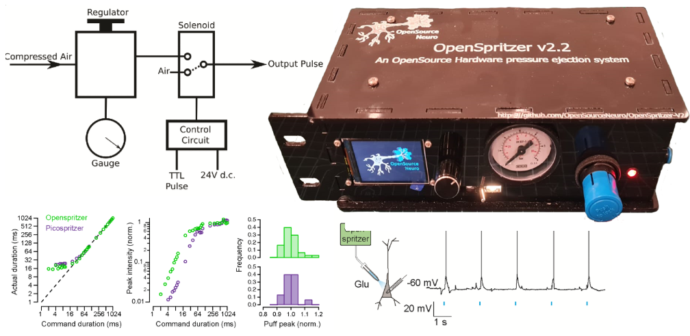

<h1 align="center"> OpenSpritzer v2</h1>
<h3 align="center">  An Open hardware pressure ejection system for reliably delivering picolitre volumes.</h3>

<h6 align="right">developed by M.J.Y. Zimmermann</h6>

 

This project is licensed under the <a href="https://www.gnu.org/licenses/gpl-3.0.html">GNU General Public License v3.0</a>
 
The hardware is licensed under the <a href="https://cern-ohl.web.cern.ch">CERN OHL v1.2</a>

***

Designed for ease of use, robustness and low-cost, the “Openspritzer” is an open hardware “Picospritzer” as routinely used in biological labs around the world. The performance of Openspritzer and commercial alternatives is effectively indistiguishable.

The system is based on a solenoid valve connected to a pressure gauge. Control can be attained directly via an external TTL pulse or internally through an Arduino set by a rotary encoder. The basic setup can be put together for 3-400€, or substantially less if you are prepare to shop around.

We anticipate that due to its high performance and low cost Openspritzer will be of interest to a broad range of researchers working in the life and physical sciences.

