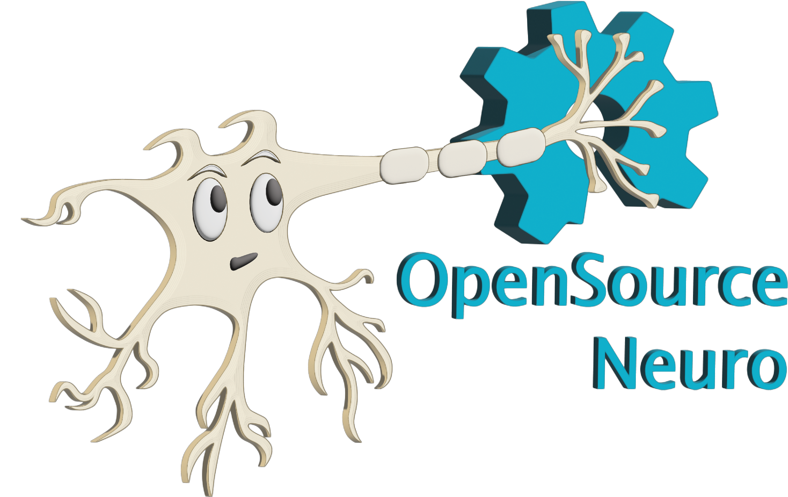

<h1 align="center"> OpenSpritzer v2</h1>
<h3 align="center">  An Open hardware pressure ejection system for reliably delivering picolitre volumes.</h3>

<h6 align="right">developed by M.J.Y. Zimmermann</h6>

  

This project is licensed under the <a href="https://www.gnu.org/licenses/gpl-3.0.html">GNU General Public License v3.0</a>
 
The hardware is licensed under the <a href="https://cern-ohl.web.cern.ch">CERN OHL v1.2</a>

***

Designed for ease of use, robustness and low-cost, the “Openspritzer” is an open hardware “Picospritzer” as routinely used in biological labs around the world. The performance of Openspritzer and commercial alternatives is effectively indistiguishable.

The system is based on a solenoid valve connected to a pressure gauge. Control can be attained directly via an external TTL pulse or internally through an Arduino set by a rotary encoder. The basic setup can be put together for ~400€, or substantially less if you are prepare to shop around.

We anticipate that due to its high performance and low cost Openspritzer will be of interest to a broad range of researchers working in the life and physical sciences.

 

The original work was published in <a href="https://www.nature.com/articles/s41598-017-02301-2"> Forman et al. 2017, Scientific Reports</a>

***

<h2 align="left">
OpenSpritzer, a DIY open source micro-injector:
</h2>

 

Compared to similar commercial systems that can cost up to several thousand pounds, the cost of the fully equipped Openspritzer (~£300) makes it particularly attractive for those wishing to pursue cutting-edge techniques in low resource environments.

This repository contains detailed <a href="https://github.com/OpenSourceNeuro/OpenSpritzer-V2/blob/main/Installation_Manual.md">assembly instructions and an operation manual</a> for OpenSpritzer. The <a href="https://github.com/OpenSourceNeuro/OpenSpritzer-V2/blob/main/BOM.csv">bill of material</a> details all pneumatic, mechanical and electronic components required.

To simplify the wiring assembly, a customed circuit board has been designed. PCB prototype companies (i.e. <a href="jlcpcb.com"> JLCPCB</a>) will only require the <a href="https://github.com/OpenSourceNeuro/OpenSpritzer-V2/tree/main/PCB_Rack%20version"> gerber.zip</a> folder to be sent to them for production.

  

***

<h2 align="left">
Openspritzer rivals the performance of commercial systems:
</h2>

 

Openspritzer control over dose delivery matches that of a leading commercial alternative.

To directly assess the time precision and reliability of Openspritzer we visualised fluorescent dye puffs from a sharp microelectrode under two-photon microscopy. The images were taken from a puff with a duration of several seconds using a wide area scan (rectangles).

Fluorescence profiles of different command-duration puffs are shown for Openspritzer (green) and Picospritzer, a popular microinjection system(purple), respectively. The same data is shown again in log-log space to highlight details of shorter pulses. Overall, both devices behave in a very similar way in terms of providing effective and near linear control over the total dosage.

  

***

<h2 align="left">
OpenSpritzer in neuroscience experiments:
</h2>

 

Openspritzer controls neural activity by delivering neurotransmitters with millisecond precision.

To demonstrate the utility of Openspritzer, we use it in a series of standard neurobiological applications: We delivered precise amounts of glutamate(cyan) and GABA(orange) to hippocampal neurons to elicit time- and dose-precise excitatory and inhibitory responses respectively, while monitoring the voltage response of the recorded neuron in current-clamp mode.

20 ms doses of glutamate (100 μM) reliably evoked excitatory postsynaptic potentials (EPSPs) and action potentials. Similarly, action potential activity elicited via somatic current injection could be suppressed by 20 ms puffs of GABA (100 μM).

To assess the accuracy of the drug delivery, we applied 10 sweeps where a 20 ms glutamate puff was applied after 500 ms produced almost identical EPSPs demonstrating the precise timing of Openspritzer and highly conserved puff volumes.

Then, to test the effect of command duration on effective dose delivey, we next applied puffs of increasing duration from 10 to 100 ms in 10 ms steps. Here, each additional 10 ms increase in duration produced a clear increase in both EPSP duration and amplitude. These results confirm the reliability and precision of Openspritzer for delivering small doses of an agent to a widely used biological sample in a controlled manner.

  

